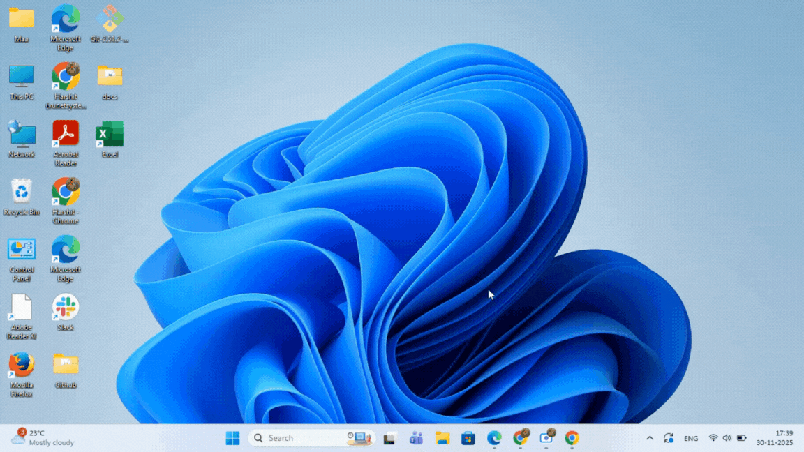

---   
description: Explain how to set up Shortcut on the desktop     
title: Putting a Shortcut on the Desktop   
read_time: 2min read   
product_version: '1.0'   
sidebar_position: 1
---

**Effective Date: 30th NOV  2025**

**Attributes**

| Team | ScreenConnect |
|---|---|
| Author | Harshit Soni |
| Reviewer |  |
| Publication Date |  |
| Product Version | 1.0 |
| Revision Number |  |
| Revision Date |  |

**Audience:** **Non-Technical Users**

**Table of Contents**

- [Putting a Shortcut on the Desktop](#putting-a-shortcut-on-the-desktop)
- [What is a shortcut on your desktop?](#what-is-a-shortcut-on-your-desktop)
- [Why create a shortcut?](#why-create-a-shortcut)
- [Steps to create a shortcut](#steps-to-create-a-shortcut)
	- [For Application](#for-application)
	- [For File and Folder](#for-file-and-folder)
	- [For Website](#for-website)
	- [Alternative Method](#for-website)
- [Author’s Note](#authors-note)

# Putting a Shortcut on the Desktop

## What is a shortcut on your desktop?

A shortcut (↗) is an icon on your desktop that provides a quick access to your frequently used application, file, folder, or website. Think of it like a bookmark for your computer, instead of searching through menus every time you want to use an application, you can simply double-click the shortcut icon on your desktop.

A shortcut does not change a file's location; it just lets you open the file quickly. You'll recognize shortcut icons by the small arrow (↗) in the lower-left corner of the icon.

## Why create a shortcut?

Shortcuts save time by allowing you quick access to the programs you use the most. Instead of having to navigate through the Start menu every time, your favorite applications may be found with a simple double-click on your desktop.

## Steps to create a shortcut

### For Application

1. Click the **Start** button on the taskbar (Windows logo in the corner)

2. Click **All apps** in the upper right corner

3. Scroll through the alphabetical list to find your application (for example, Excel)

4. **Left-click and hold** on the app name

5. **Drag** it to an empty space on your desktop

6. Release the mouse button

### For File and Folder

1. Open **File Explorer** (the folder icon on your taskbar) and find the file or folder you want to create a shortcut for (example “TO-DO List” file).

2. Make sure you can see both the File Explorer window and some empty space on your desktop.

3. **Right-click and hold** on the file or folder icon.

4. **Drag** the icon over to your desktop space.

5. Release the mouse button. A small menu will pop up.

6. Select **Create shortcuts here** from the menu.

💡**Note:**

- For Application: Left-click drag (this works for Start menu apps)

- For File/Folder: Right-click drag (this creates shortcuts; left-click would copy)

💡**TIPS: **You can put a shortcut in any folder, in addition to on the desktop. When you delete a shortcut, the original file is not deleted. If you delete the file, the shortcut is not deleted automatically.

### For Website

1. **Open your web browser** (like Edge, Chrome, or Firefox) and navigate to the website you want a shortcut for.

2. **Resize your browser window** so you can see both the webpage and an empty space on your desktop background at the same time.

3. Find the small **padlock** or **globe icon** in the address bar (just to the left of the website URL)

4. **Left-click and hold** that icon.

5. **Drag** it out of the browser window and drop it onto your desktop.

A new icon will instantly appear on your desktop with the website’s name. Double-clicking this icon will open the website directly in your default browser.

💡**Note**: Some Windows Store apps (like certain built-in Microsoft apps) may not drag directly. For these apps, see [Alternative Method](#alternative-method).

### Alternative Method

1. **Right-click** anywhere on your desktop.

2. Select **New > Shortcut**.

3. Click **Browse**, choose the file/app/folder you want, then click **OK**. \
 *(Or type/paste a website link.)*

4. Click **Next**.

5. Type a name for the shortcut and click **Finish**.

# Author’s Note

I updated the “Putting a shortcut on your desktop” section from the old Windows 95 document for Windows 11. While creating this document, I made sure the content stays to the point and succinct, with crisp steps for creating shortcuts for Applications, Files/Folders, and Websites. I’ve also added supporting visual cues (gifs) and an alternative method.

For non-technical users, I believe the drag-and-drop method is the best. It’s visually intuitive, fastest, requires the fewest clicks, and avoids forcing users to navigate through complex submenus.

While alternatives like **“Send to Desktop”** do exist, they add unnecessary complexity. They require users to go through nested menus (Right-click> **Show more options** > **Send to** > **Desktop**), which can be confusing for beginners who may not understand folder structures or file locations.

I also included **New > Shortcut** as a dependable fallback option.
